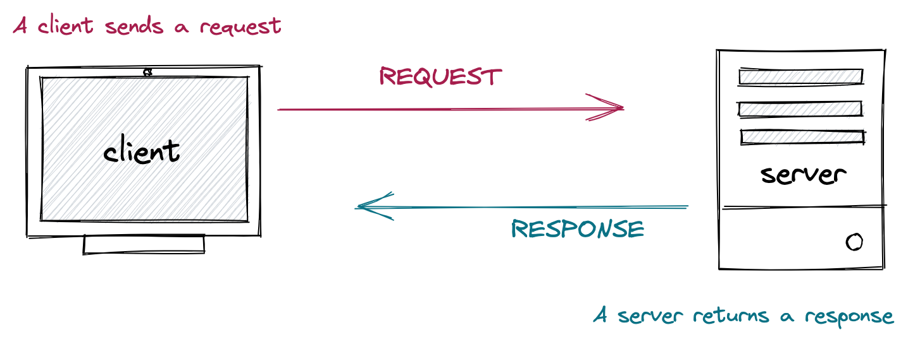
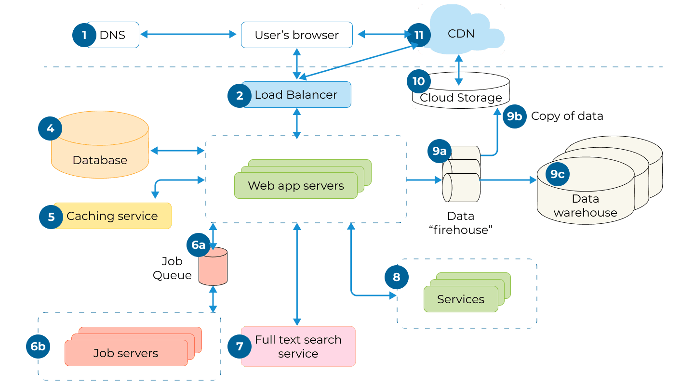
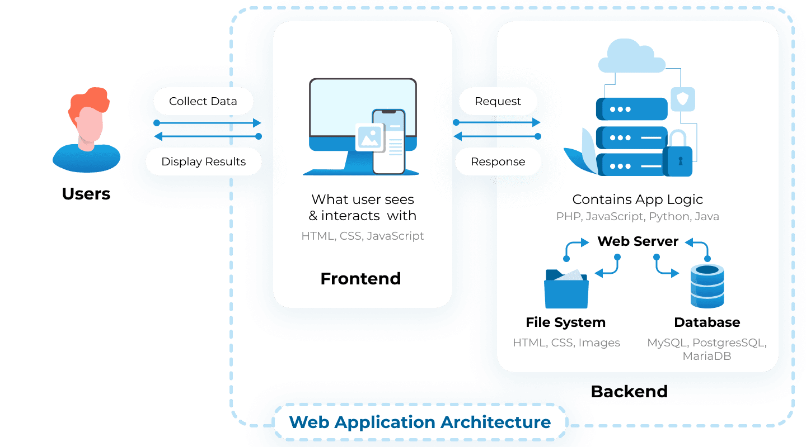

# Introduction to Express.js

_a framework for building web applications with Node.js_

---

## What is a web application?

- A web application is a program that runs on a web server, handles client requests, and generates responses to those requests.
- It runs on a web server rather than being installed on the user's device.
- Web applications use a client-server architecture, with the client (browser) making requests to the server for data or functionality.
- Examples include social media sites, online shopping platforms, and productivity tools.

---



---

It is a little more complicated than this.[^1]

[^1]: [https://litslink.com/blog/web-application-architecture](https://litslink.com/blog/web-application-architecture)

---



---

# 😰

---



---

# Why do we need a framework?

- A **structure** for organizing code and a set of tools for common tasks.
- Simplifies the process of building applications by providing a set of **conventions and best practices**.
- Allows developers to **focus on building** the application rather than reinventing the wheel.
- It provides a **community** of developers who can help with troubleshooting and support.

---

# Meet Express.js

- Express.js is a web application framework for Node.js.
- Features and benefits include routing, handling for requests and responses, middleware support, and easy integration with databases.
- Express is widely used in real applications, such as web servers, APIs, and full-stack web development.

Express.js Documentation: [https://expressjs.com/](https://expressjs.com/)

---

# Creating a New Express Project

1.  Create a new directory called "express-hello-world", and then navigate into it.
2. Run `npm init -y` to set up a new Node.js project.
3. Run `npm install express` to install Express as a project dependency.
4. Open `package.json` and add this line to the `scripts` section: 
   ```
   "start": "node index.js"
   ```
   This will allow us to run our application using `npm start`.
5. Create a new file called `index.js`. We're going to put some code in this file to get our server up and running.

---

```js
// index.js
const express = require("express")

// config
const port = process.env.PORT || 3000 

// initialize Express app
const app = express()

// start server
app.listen(port, () => {
    console.log(`App listening at http://localhost:${port}`)
})
```

### Run the server by running `npm start` in your terminal.
---

# Routing and GET Requests

Express uses routes to define how an application responds to client requests.

A route is a combination of a **path** and a **HTTP verb**.

Let's add a route to our application that responds to GET requests to the root path (`/`).

```js
// home page route
app.get("/", (req, res) => {
  res.send("Hello World!")
})
```

---

# `app.get()` Method

The `app.get()` method is used to define a route that responds to GET requests.

The first parameter is the _path_, and the second parameter is a _callback function_ that runs when a request is received.

The callback function takes two parameters: `req` and `res`.

[Express docs: Application object](https://expressjs.com/en/4x/api.html#app)

[Express docs: routing methods on app object](https://expressjs.com/en/4x/api.html#app.get.method)

---

# Request and Response Objects

The `req` and `res` parameters in the route handler function are objects that represent the HTTP request and response.

[Express Request object](https://expressjs.com/en/4x/api.html#req)

[Express Response object](https://expressjs.com/en/4x/api.html#res)

---

# Middleware

Middleware is a function that runs before the route handler. It can be used to perform common tasks like logging, authentication, and error handling.

We'll install [a middleware called `morgan`](https://github.com/expressjs/morgan) for logging.

```js
// index.js

const morgan = require("morgan")

app.use(morgan("tiny"))
```
 Run your server and look at the output.

---

# Route Paths

Route paths can be strings, string patterns, or regular expressions. Route paths define the URLs that our application provides.

Let's add a route for `/hello` that responds with "Hello World!". We'll format the response as JSON this time.

```js
app.get("/hello/", (req, res) => {
  res.json({message: "Hello World!"})
})
```

Make sure your server is running and go to [http://localhost:3000/hello](http://localhost:3000/hello) in your browser.

---

## Nodemon

- Install **[nodemon](https://nodemon.io/)** to automatically restart your server when you make changes to your code
- Run `nodemon <filename>` to run a JS file in Node with nodemon

---

# Route Parameters

Route parameters are named URL segments that are used to capture the values specified at their position in the URL.

Let's add a route for `/hello/:name` that responds with "Hello, [name]!". We'll use the `req.params` object to access the value of the `name` parameter.

```js
app.get("/hello/:name", (req, res) => {
  res.json({message: `Hello, ${req.params.name}!`})
})
```

[Express docs: route params](https://expressjs.com/en/guide/routing.html#route-parameters)

---

# Query Parameters

Query parameters are used to provide additional data to the server. They are appended to the end of the URL after a `?`.

Let's add a route for `/hello` that responds with "Hello, [name]!" if a `name` query parameter is provided.

```js

app.get("/hello", (req, res) => {
  if (req.query.name) {
    res.json({message: `Hello, ${req.query.name}!`})
  } else {
    res.json({message: "Hello, World!"})
  }
})
```

[Express docs: res.query](https://expressjs.com/en/4x/api.html#req.query)

---

## Extending our application

- Clone the demo repo and navigate into the project folder.
- Run `npm install` inside the project folder to install dependencies
- Add a route for `/goodbye` that responds with a "Goodbye!" message in json.
- Add a hello route that includes a route parameter that will accept a two-letter language code from [this list of ISO language codes](https://en.wikipedia.org/wiki/List_of_ISO_639_language_codes)
    - Implement at least two different languages (look up how to say hello/goodbye in those languages if you don’t know!) so that you return a json response with a message in the requested language.
    
    for example:
    
        `/hello/zh`  → `{”message”: “Ni hao”}`
        
        `/hello/de` → `{"message": "Guten tag"}`
        
    - If the path includes a language code that you don’t support, default to English.

---

Consult the [Express routing guide](https://expressjs.com/en/guide/routing.html) and other documentation as you work.
